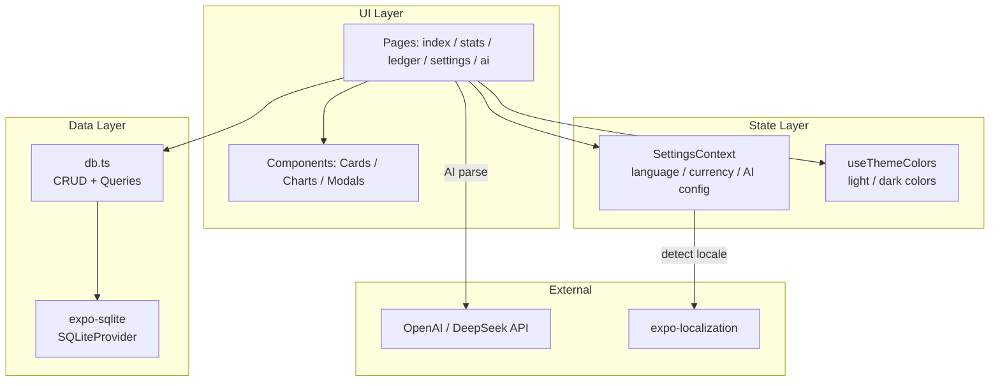
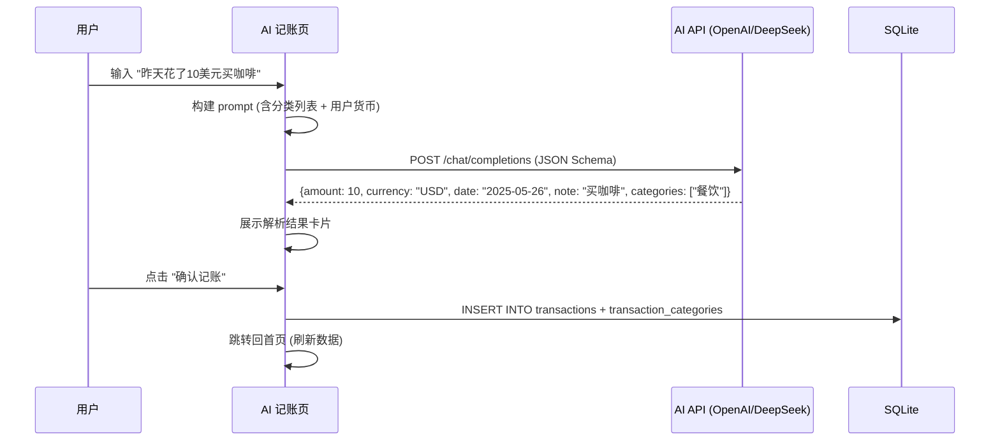

# AIAccounting — 项目架构文档

> **AI 智能多维度记账 App**
> 跨平台（iOS / Android / Web）· React Native + Expo SDK 56 · SQLite 本地存储 · i18n 中英双语

---

## 1. 项目概述

AIAccounting 是一款以 **AI 智能解析** 为核心功能的个人记账应用。用户可以通过自然语言描述（文字或语音）快速录入账单，AI 自动识别金额、日期、备注和分类，并支持多维度分类归属，实现更灵活的支出分析。

### 核心特性

| 特性 | 说明 |
|------|------|
| 🤖 AI 智能记账 | 自然语言输入，AI 自动解析金额、日期、备注、多分类 |
| 🎙️ 语音输入 | 语音识别转文字，配合 AI 记账 |
| 📊 多维度统计 | 按分类、时段、支出结构（日常/固定/弹性）分析 |
| 🌐 多语言支持 | 中文 / English，系统跟随 + 手动切换 |
| 🌗 深色模式 | 自动适配系统主题 + 手动切换 |
| 💱 多币种 | 支持 CNY / USD / EUR / JPY 等主流货币 |
| 🏷️ 多对多分类 | 一笔交易可归属多个分类（如"午餐"同时属于"餐饮"和"社交"） |
| 📱 跨平台 | iOS / Android / Web 三端统一体验 |

---

## 2. 技术栈

```
┌─────────────────────────────────────────────────┐
│                   应用层 (App)                   │
│  React Native 0.85 · Expo SDK 56 · TypeScript 6 │
├─────────────────────────────────────────────────┤
│                   路由层 (Router)                │
│  expo-router v56 (file-based routing)           │
│  unstable-native-tabs (iOS/Android)             │
│  expo-router/ui (Web)                            │
├─────────────────────────────────────────────────┤
│                   状态管理                        │
│  React Context (SettingsContext)                 │
│  useSQLiteContext (数据库连接)                    │
├─────────────────────────────────────────────────┤
│                   数据层                          │
│  expo-sqlite (SQLite WAL 模式)                   │
│  本地持久化，零网络依赖                            │
├─────────────────────────────────────────────────┤
│                   AI 层                          │
│  OpenAI / DeepSeek API (可配置)                  │
│  JSON Schema 结构化输出                           │
├─────────────────────────────────────────────────┤
│                   国际化 (i18n)                   │
│  i18next + react-i18next                        │
│  expo-localization (系统语言检测)                  │
└─────────────────────────────────────────────────┘
```

### 依赖一览

| 分类 | 包名 | 版本 | 用途 |
|------|------|------|------|
| **核心** | react | 19.2.3 | UI 框架 |
| | react-native | 0.85.3 | 跨平台原生层 |
| | expo | ~56.0.5 | 开发平台 |
| **路由** | expo-router | ~56.2.7 | 文件式路由 + Tab 导航 |
| **数据** | expo-sqlite | ~56.0.4 | 本地 SQLite 数据库 |
| **UI** | expo-linear-gradient | ~56.0.4 | 渐变色效果 |
| | expo-glass-effect | ~56.0.4 | 毛玻璃效果 |
| | @expo/vector-icons | ^15.0.2 | Ionicons 图标库 |
| | react-native-svg | 15.15.4 | SVG 渲染（环形图） |
| **动画** | react-native-reanimated | 4.3.1 | 高性能动画 |
| | react-native-gesture-handler | ~2.31.1 | 手势交互 |
| **i18n** | i18next | ^26.3.0 | 国际化核心 |
| | react-i18next | ^17.0.8 | React 绑定 |
| | expo-localization | ~56.0.6 | 系统语言检测 |
| **AI** | expo-speech-recognition | ^56.0.0 | 语音识别 (需 dev client) |
| | expo-speech | ~56.0.3 | TTS 语音合成 |
| **开发** | typescript | ~6.0.3 | 类型安全 |

---

## 3. 目录结构

```
aiaccounting/
├── app.json                    # Expo 配置
├── package.json                # 依赖 & 脚本
├── tsconfig.json               # TypeScript 配置
├── metro.config.js             # Metro bundler 配置
├── assets/                     # 静态资源（图标、splash）
├── docs/
│   ├── design/                 # 设计参考图
│   │   ├── design-ai-entry.png         # AI 记账页设计
│   │   ├── design-stats-settings.png   # 统计 + 设置页设计
│   │   └── design-full-overview.png    # 完整 5 屏概览
│   ├── ARCHITECTURE.md         # 📌 本文档 — 架构说明
│   ├── UI_DESIGN.md            # UI 设计规范
│   └── DATABASE.md             # 数据库设计
├── scripts/                    # 工具脚本
└── src/
    ├── app/                    # 📱 页面（expo-router file routing）
    │   ├── _layout.tsx         # 根布局（SQLite + Settings Provider）
    │   ├── index.tsx           # 🏠 首页仪表盘
    │   ├── stats.tsx           # 📊 支出统计
    │   ├── ledger.tsx          # 📋 账单列表
    │   ├── settings.tsx        # ⚙️ 设置
    │   └── ai.tsx              # 🤖 AI 记账（全屏）
    ├── components/             # 🧩 共享组件
    │   ├── MonthlySummaryCard.tsx   # 首页渐变月度总结卡
    │   ├── QuickEntryGrid.tsx      # 首页快速入口（3 个按钮）
    │   ├── TransactionItem.tsx     # 统一交易列表项
    │   ├── SettingsRow.tsx         # iOS 风格设置行
    │   ├── DonutChart.tsx          # SVG 环形图
    │   ├── ManualAddModal.tsx      # 手动记账弹窗
    │   ├── AiEntryModal.tsx        # AI 记账组件（legacy modal）
    │   ├── app-tabs.tsx            # 原生 5-Tab 导航
    │   ├── app-tabs.web.tsx        # Web 5-Tab 导航
    │   ├── themed-text.tsx         # 主题感知文本
    │   ├── themed-view.tsx         # 主题感知容器
    │   └── ui/                     # 底层 UI 原子组件
    ├── constants/
    │   └── theme.ts            # 🎨 全局主题系统（颜色/阴影/圆角/字体/间距）
    ├── context/
    │   └── SettingsContext.tsx  # ⚙️ 全局设置状态管理
    ├── database/
    │   └── db.ts               # 💾 SQLite 建表 + CRUD + 统计查询
    ├── hooks/
    │   ├── useThemeColors.ts   # 主题颜色 hook
    │   ├── use-theme.ts        # 主题 key hook
    │   ├── use-color-scheme.ts # 系统外观检测
    │   └── use-color-scheme.web.ts  # Web 端外观检测
    ├── i18n/
    │   ├── index.ts            # i18next 初始化
    │   └── locales/
    │       ├── en.json         # 英文翻译
    │       └── zh.json         # 中文翻译
    ├── utils/
    │   ├── ai.ts               # AI API 调用 & 解析逻辑
    │   └── currency.ts         # 货币格式化 & 汇率工具
    ├── declarations.d.ts       # 全局类型声明
    └── global.css              # 全局 Web 样式
```

---

## 4. 数据流架构



### 数据流说明

1. **页面启动** → `_layout.tsx` 初始化 `SQLiteProvider` + `SettingsProvider`
2. **设置加载** → `SettingsContext` 从 `user_settings` 表读取语言、货币、AI 配置
3. **页面渲染** → 各页面通过 `useSQLiteContext()` 获取 DB 实例，调用 `db.ts` 方法读写数据
4. **主题渲染** → 组件通过 `useThemeColors()` 获取当前 light/dark 颜色
5. **AI 记账** → 用户输入 → `utils/ai.ts` 调用 AI API → 返回结构化结果 → 用户确认 → 写入 DB
6. **国际化** → `i18next` 根据 `language` 设置加载对应 JSON，所有 UI 文字通过 `t()` 函数获取

---

## 5. 导航架构

```
┌──────────────────────────────────────────────────┐
│                 Tab Bar (5 Tabs)                  │
├──────┬──────┬─────────────┬──────┬───────────────┤
│ 🏠   │ 📊   │    ➕       │ 📋   │     ⚙️        │
│ 首页  │ 统计  │  (FAB)     │ 账单  │    设置       │
│ Home │ Stats │  AI Entry  │Ledger│  Settings     │
├──────┴──────┴─────────────┴──────┴───────────────┤
│                                                    │
│  中间 ➕ 按钮 = FAB (Floating Action Button)        │
│  点击直接进入 AI 记账全屏页面                         │
│                                                    │
│  首页额外提供 3 个快捷入口:                           │
│  🎙️ 语音  |  ✏️ 手动  |  📷 扫描                    │
│  (扫描为占位，提示"即将推出")                         │
└──────────────────────────────────────────────────┘
```

### 路由映射

| Tab | 路由路径 | 文件 | 说明 |
|-----|---------|------|------|
| 首页 | `/` | `src/app/index.tsx` | 仪表盘：问候语 + 月度总结 + 快捷入口 + 最近账单 |
| 统计 | `/stats` | `src/app/stats.tsx` | 统计：周/月/年维度的支出分析 |
| ＋ | `/ai` | `src/app/ai.tsx` | AI 记账全屏页 |
| 账单 | `/ledger` | `src/app/ledger.tsx` | 完整账单列表（搜索/筛选） |
| 设置 | `/settings` | `src/app/settings.tsx` | 系统设置 + 分类管理 |

---

## 6. 页面功能详解

### 6.1 首页 (index.tsx)

```
┌─────────────────────────────┐
│ 🌤 早上好 👋               🔔│
│ 我的账单                      │
├─────────────────────────────┤
│ ┌─────────────────────────┐ │
│ │   ▽▽▽ 渐变绿色卡片 ▽▽▽  │ │
│ │   本月总支出  ¥4,820     │ │
│ │ ┌──────┬──────┬──────┐  │ │
│ │ │收入   │支出   │结余   │  │ │
│ │ │¥8,100│¥4,250│¥3,850│  │ │
│ │ └──────┴──────┴──────┘  │ │
│ └─────────────────────────┘ │
│                              │
│ 快速记账                      │
│ ┌──────┐ ┌──────┐ ┌──────┐ │
│ │ 🎙️   │ │ ✏️   │ │ 📷   │ │
│ │ 语音  │ │ 手动  │ │ 扫描  │ │
│ └──────┘ └──────┘ └──────┘ │
│                              │
│ 最近账单            查看全部 →│
│ ┌─────────────────────────┐ │
│ │ 🍔 午饭    ¥32     12:30│ │
│ │ 🚗 打车    ¥28     11:15│ │
│ │ ☕ 咖啡    ¥35     09:00│ │
│ └─────────────────────────┘ │
└─────────────────────────────┘
```

### 6.2 AI 记账页 (ai.tsx)

```
┌─────────────────────────────┐
│ ← AI 记账           ✦ 智能解析│
│                              │
│ ┌─────────────────────────┐ │
│ │ ✨ 用自然语言描述这笔账   │ │
│ │                          │ │
│ │ 昨天花了 10 美元买咖啡    │ │
│ └─────────────────────────┘ │
│                              │
│          ┌─────┐              │
│          │ 🎙️  │              │
│          └─────┘              │
│                              │
│ 常用短语                      │
│ [午饭吃了…] [打车去机场]      │
│ [买了一件衣服] [收到工资]     │
│                              │
│ ┌─────────────────────────┐ │
│ │ AI 已解析 — 请确认       │ │
│ │ 金额    ¥72.40 ($10×7.24)│ │
│ │ 日期    2025年5月26日     │ │
│ │ 备注    买咖啡             │ │
│ │ 分类    [餐饮] [社交]      │ │
│ └─────────────────────────┘ │
│                              │
│ ┌─────────────────────────┐ │
│ │     ✓ 确认记账            │ │
│ └─────────────────────────┘ │
└─────────────────────────────┘
```

### 6.3 统计页 (stats.tsx)

- **周期切换器**：周 / 月 / 年
- **摘要数据**：总支出 / 笔数 / 日均
- **环形图**：按分类占比的可视化
- **分类明细**：带色点 + 百分比列表
- **支出结构**：日常 / 固定 / 弹性 进度条

### 6.4 账单页 (ledger.tsx)

- **搜索栏**：按关键字模糊搜索
- **筛选器**：全部 / 仅支出 / 仅收入
- **按日期分组**：日期标题 + 当日小计
- **长按操作**：编辑 / 删除

### 6.5 设置页 (settings.tsx)

- **账户与偏好**：货币切换、语言切换、深色模式
- **AI 配置**：Provider / Model / API Key / Base URL
- **数据管理**：导出数据、清空数据
- **分类管理**：自定义分类 CRUD

---

## 7. AI 记账流程



### AI Prompt 结构

```json
{
  "role": "system",
  "content": "你是记账助手。用户用自然语言描述账单，你提取结构化数据。"
},
{
  "role": "user", 
  "content": "用户输入: {text}\n可用分类: {categories}\n默认货币: {currency}\n今天日期: {today}"
}
```

### 返回格式 (JSON Schema)

```typescript
interface AiParsedResult {
  type: 'expense' | 'income';
  amount: number;
  original_currency: string;
  date: string;           // YYYY-MM-DD
  note: string;
  category_names: string[]; // 多分类
}
```

---

## 8. 构建 & 运行

### 开发

```bash
# 安装依赖
npm install

# 启动开发服务器
npm run start

# 指定平台
npm run ios       # iOS 模拟器
npm run android   # Android 模拟器
npm run web       # 浏览器
```

### 类型检查

```bash
npx tsc --noEmit
```

### 生产构建

```bash
npx expo export            # 静态导出 (Web)
npx eas build -p ios       # iOS 云构建
npx eas build -p android   # Android 云构建
```

### 注意事项

> ⚠️ `expo-speech-recognition` 需要 **Expo Dev Client**，不支持 Expo Go。如需在 Expo Go 中运行，语音识别功能会自动降级为不可用。

---

## 9. 环境要求

| 项目 | 版本要求 |
|------|---------|
| Node.js | >= 18 |
| npm | >= 9 |
| Expo CLI | SDK 56 兼容 |
| iOS | >= 15 |
| Android | API >= 24 (Android 7+) |
| TypeScript | ~6.0 |
