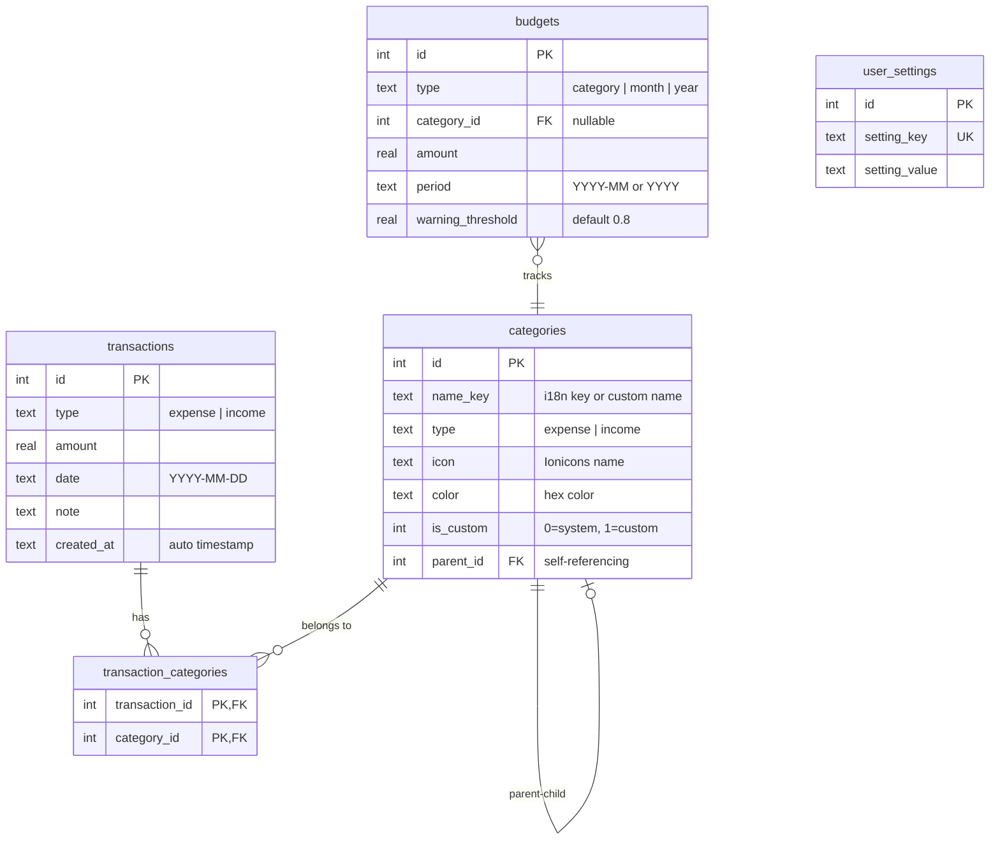
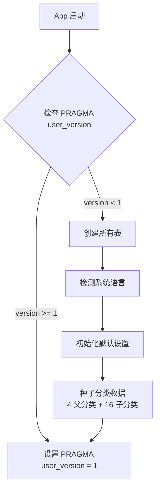

# AIAccounting — 数据库设计文档

> 本文档描述了应用的 SQLite 数据库结构、表关系、数据模型和查询模式。
> 数据库文件：`expo-sqlite` 管理的本地 SQLite 数据库（WAL 模式）

---

## 1. ER 关系图



---

## 2. 表结构详解

### 2.1 transactions — 交易记录

| 列 | 类型 | 约束 | 说明 |
|----|------|------|------|
| `id` | INTEGER | PK AUTOINCREMENT | 主键 |
| `type` | TEXT | NOT NULL, CHECK(`expense`/`income`) | 交易类型 |
| `amount` | REAL | NOT NULL | 金额（以默认货币存储） |
| `date` | TEXT | NOT NULL | 日期 (`YYYY-MM-DD`) |
| `note` | TEXT | 可空 | 备注 |
| `created_at` | TEXT | DEFAULT CURRENT_TIMESTAMP | 创建时间 |

### 2.2 categories — 分类

| 列 | 类型 | 约束 | 说明 |
|----|------|------|------|
| `id` | INTEGER | PK AUTOINCREMENT | 主键 |
| `name_key` | TEXT | NOT NULL | 翻译 key（如 `category.daily.food`）或自定义名称 |
| `type` | TEXT | NOT NULL, CHECK(`expense`/`income`) | 分类类型 |
| `icon` | TEXT | 可空 | Ionicons 图标名 |
| `color` | TEXT | 可空 | 十六进制颜色 |
| `is_custom` | INTEGER | DEFAULT 0 | 0=系统预设, 1=用户自定义 |
| `parent_id` | INTEGER | FK → categories.id, ON DELETE CASCADE | 父分类 ID |

#### 层级结构

```
支出 (expense)
├── 日常支出 (category.parent.daily)
│   ├── 餐饮 (category.daily.food)
│   ├── 交通 (category.daily.transport)
│   ├── 日用品 (category.daily.necessities)
│   └── 娱乐 (category.daily.entertainment)
├── 固定支出 (category.parent.fixed)
│   ├── 房租 (category.fixed.rent)
│   ├── 物业费 (category.fixed.property)
│   ├── 水电气 (category.fixed.utilities)
│   ├── 话费网费 (category.fixed.digital)
│   └── 家电家具 (category.fixed.appliances)
└── 弹性支出 (category.parent.flexible)
    ├── 社交 (category.flexible.social)
    ├── 自我提升 (category.flexible.self_improvement)
    ├── 服饰 (category.flexible.clothing)
    └── 旅游 (category.flexible.travel)

收入 (income)
└── 收入 (category.parent.income)
    ├── 工资 (category.income.salary)
    ├── 理财 (category.income.finance)
    └── 意外之财 (category.income.windfall)
```

### 2.3 transaction_categories — 多对多关联表

| 列 | 类型 | 约束 | 说明 |
|----|------|------|------|
| `transaction_id` | INTEGER | PK, FK → transactions.id, ON DELETE CASCADE | 交易 ID |
| `category_id` | INTEGER | PK, FK → categories.id, ON DELETE CASCADE | 分类 ID |

> **核心设计**：一笔交易可以归属多个分类。例如"和朋友聚餐"可以同时属于"餐饮"和"社交"。
> 统计时按分类分别计算，因此分类维度的总和可能大于实际支出总额。

### 2.4 budgets — 预算

| 列 | 类型 | 约束 | 说明 |
|----|------|------|------|
| `id` | INTEGER | PK AUTOINCREMENT | 主键 |
| `type` | TEXT | NOT NULL, CHECK(`category`/`month`/`year`) | 预算类型 |
| `category_id` | INTEGER | FK → categories.id, ON DELETE CASCADE | 分类预算的目标分类 |
| `amount` | REAL | NOT NULL | 预算金额 |
| `period` | TEXT | NOT NULL | 预算周期（`YYYY-MM` 或 `YYYY`） |
| `warning_threshold` | REAL | DEFAULT 0.8 | 警告阈值（80%） |

### 2.5 user_settings — 用户设置

| 列 | 类型 | 约束 | 说明 |
|----|------|------|------|
| `id` | INTEGER | PK AUTOINCREMENT | 主键 |
| `setting_key` | TEXT | UNIQUE NOT NULL | 设置键 |
| `setting_value` | TEXT | NOT NULL | 设置值 |

#### 预设设置项

| Key | 默认值 | 说明 |
|-----|--------|------|
| `language` | 系统语言 (`zh`/`en`) | 界面语言 |
| `default_currency` | 系统区域 (`CNY`/`USD`) | 默认货币 |
| `ai_provider` | `openai` | AI 服务商 |
| `ai_api_key` | *(空)* | API 密钥 |
| `ai_api_url` | `https://api.openai.com/v1` | API 基础 URL |
| `ai_model` | `gpt-4o-mini` | AI 模型 |

---

## 3. 数据库初始化流程



### 关键配置

```sql
PRAGMA journal_mode = WAL;   -- Write-Ahead Logging (并发读写)
PRAGMA foreign_keys = ON;    -- 启用外键约束
```

---

## 4. 核心查询

### 4.1 获取交易列表（含分类）

```sql
-- Step 1: 获取交易
SELECT t.* FROM transactions t 
ORDER BY t.date DESC, t.id DESC 
LIMIT ? OFFSET ?;

-- Step 2: 获取每笔交易的分类（多对多）
SELECT c.*, p.name_key as parent_name_key 
FROM categories c 
INNER JOIN transaction_categories tc ON tc.category_id = c.id 
LEFT JOIN categories p ON c.parent_id = p.id
WHERE tc.transaction_id = ?;
```

### 4.2 按分类统计支出

```sql
SELECT c.id as categoryId, 
       c.name_key as categoryNameKey, 
       p.name_key as parentNameKey, 
       SUM(t.amount) as amount, 
       c.color
FROM transactions t
INNER JOIN transaction_categories tc ON tc.transaction_id = t.id
INNER JOIN categories c ON tc.category_id = c.id
LEFT JOIN categories p ON c.parent_id = p.id
WHERE t.type = 'expense' AND t.date >= ? AND t.date <= ?
GROUP BY c.id
ORDER BY amount DESC;
```

> **注意**：由于多对多关系，同一笔交易的金额可能在多个分类中重复计算。
> 例如 ¥100 的"聚餐"同时归属"餐饮"和"社交"，则两个分类各统计 ¥100。

### 4.3 按周期汇总

```sql
SELECT SUM(amount) as total 
FROM transactions 
WHERE type = ? AND date >= ? AND date <= ?;
```

### 4.4 插入交易（含多分类）

```sql
-- Step 1: 插入交易
INSERT INTO transactions (type, amount, date, note) VALUES (?, ?, ?, ?);

-- Step 2: 插入分类关联（循环）
INSERT INTO transaction_categories (transaction_id, category_id) VALUES (?, ?);
```

### 4.5 更新交易

```sql
-- Step 1: 更新交易字段
UPDATE transactions SET type = ?, amount = ?, date = ?, note = ? WHERE id = ?;

-- Step 2: 清除旧分类关联
DELETE FROM transaction_categories WHERE transaction_id = ?;

-- Step 3: 插入新分类关联
INSERT INTO transaction_categories (transaction_id, category_id) VALUES (?, ?);
```

---

## 5. TypeScript 类型定义

```typescript
interface Transaction {
  id: number;
  type: 'expense' | 'income';
  amount: number;
  date: string;          // YYYY-MM-DD
  note: string | null;
  created_at: string;
  categories?: Category[];
}

interface Category {
  id: number;
  name_key: string;      // i18n key 或自定义名称
  type: 'expense' | 'income';
  icon: string | null;
  color: string | null;
  is_custom: number;     // 0=系统, 1=自定义
  parent_id: number | null;
  parent_name_key?: string | null;
}

interface Budget {
  id: number;
  type: 'category' | 'month' | 'year';
  category_id: number | null;
  amount: number;
  period: string;
  warning_threshold: number;
}

interface UserSetting {
  id: number;
  setting_key: string;
  setting_value: string;
}

interface CategorySpending {
  categoryId: number;
  categoryNameKey: string;
  parentNameKey: string | null;
  amount: number;
  color: string | null;
}
```

---

## 6. 数据库 API 接口

| 函数 | 参数 | 返回值 | 说明 |
|------|------|--------|------|
| `migrateDbIfNeeded(db)` | SQLiteDatabase | void | 初始化/迁移数据库 |
| `getTransactions(db, limit, offset)` | db, 100, 0 | Transaction[] | 分页获取交易列表（含分类） |
| `addTransaction(db, type, amount, date, note, categoryIds)` | — | number (id) | 新增交易 |
| `updateTransaction(db, id, type, amount, date, note, categoryIds)` | — | void | 更新交易 |
| `deleteTransaction(db, id)` | — | void | 删除交易 |
| `getCategories(db)` | — | Category[] | 获取所有分类（含层级） |
| `addCategory(db, nameKey, type, icon, color, parentId)` | — | number (id) | 新增自定义分类 |
| `deleteCategory(db, id)` | — | void | 删除分类（级联删除关联） |
| `getSettings(db)` | — | Record<string, string> | 获取所有设置 |
| `updateSetting(db, key, value)` | — | void | 更新设置（UPSERT） |
| `getBudgets(db)` | — | Budget[] | 获取所有预算 |
| `addOrUpdateBudget(db, type, categoryId, amount, period, threshold)` | — | void | 新增/更新预算 |
| `deleteBudget(db, id)` | — | void | 删除预算 |
| `getSpendingByCategory(db, startDate, endDate)` | — | CategorySpending[] | 按分类统计支出 |
| `getSumByPeriod(db, type, startDate, endDate)` | — | number | 按周期汇总金额 |

---

## 7. 迁移策略

当前版本：**DATABASE_VERSION = 1**

后续版本升级时：

```typescript
if (currentDbVersion < 2) {
  // ALTER TABLE ... ADD COLUMN ...
  // 或 CREATE TABLE ...
  currentDbVersion = 2;
}
```

每次迁移后更新 `PRAGMA user_version`，确保幂等性。
